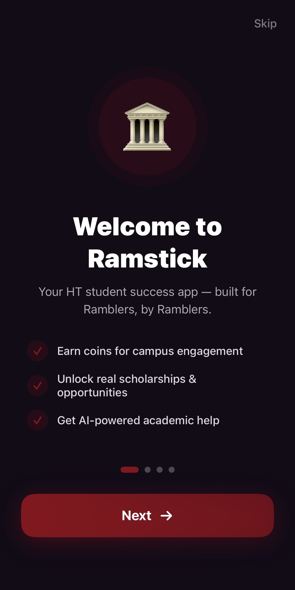
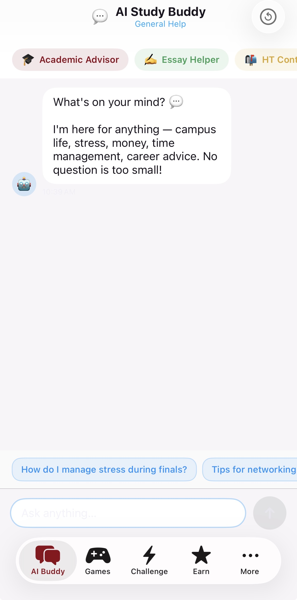
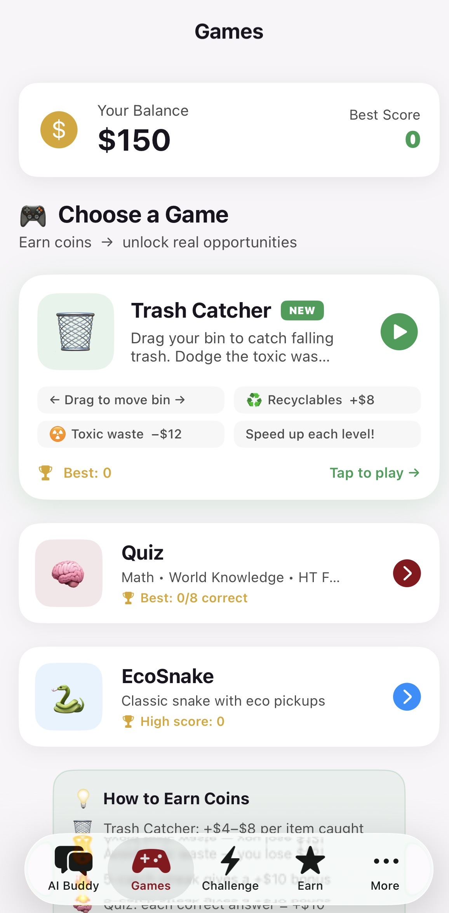
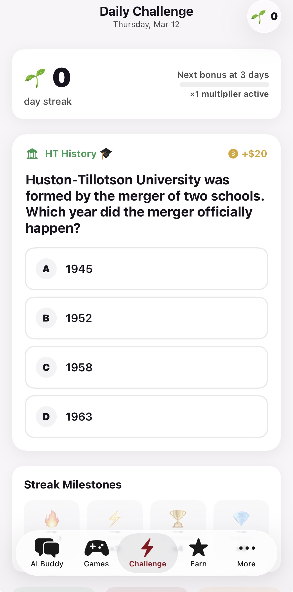
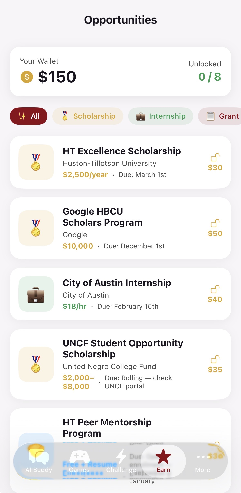

# Ramstick 📱
### AI-Powered Campus Opportunity Platform for Students

Ramstick is a gamified iOS application designed to help students discover scholarships, internships, and campus opportunities in a more engaging and accessible way.

Built by a student at Huston-Tillotson University, Ramstick combines **AI assistance, educational games, and opportunity tracking** to help students navigate resources that are often scattered across emails, flyers, and websites.

---

# 🚀 Demo

## App Preview

|Onboarding Screen | AI Assistant | Games Hub | Trash Catcher |Daily Challenge|  Opportunities | 
|---------------|-----------|---------------|---------------|-----------|---------------|
|  |  |  | |  | |

---

# 📖 The Problem

Many students struggle to navigate opportunities available to them.

- 68% of HBCU students never apply for financial aid they qualify for  
- 1 in 3 freshmen don't know where their advisor's office is  
- $46B in scholarships go unclaimed annually in the U.S.

Students often receive information through:

- Emails  
- Flyers  
- Campus announcements  

However, there is rarely a **centralized and engaging system** that helps students take action on those opportunities.

---

# 💡 The Solution

Ramstick transforms opportunity discovery into an interactive and engaging experience.

Students can:

1. Play games and complete challenges  
2. Earn in-app coins  
3. Unlock real opportunities  
4. Use AI to prepare applications and emails  

Core engagement loop:

**Play → Learn → Earn → Unlock Opportunities**

---

# ✨ Key Features

## 🤖 AI Study Buddy

AI-powered assistant with multiple support modes:

- Essay Helper  
- Academic Advisor  
- HT Contacts  
- General Assistance  

Students can use the AI to:

- Draft professional emails  
- Ask questions about opportunities  
- Get help preparing applications  

---

## 🎮 Games Hub

Gamified learning helps increase student engagement.

### Trash Catcher
- Drag a bin to catch correct items
- Avoid harmful objects
- Speed increases over time
- Streak bonuses reward accuracy

### Quiz Game

Quiz categories include:

- Math  
- Finance  
- Career  
- Campus Knowledge  
- World Knowledge  

Each round includes:

- 8 questions  
- Streak multipliers  
- Educational fun facts  

### EcoSnake

A snake-style game where players collect trash and grow their snake while increasing their score.

---

## 📅 Daily Challenge

Students receive a daily question that rewards coins when completed.

Streaks increase reward values and encourage consistent engagement.

---

## 💼 Opportunities Hub

Students spend earned coins to unlock real opportunities such as:

- Scholarships  
- Internships  
- Grants  
- Campus events  
- Networking opportunities  

Each opportunity card includes:

### Checklist
Eligibility requirements and steps needed to apply.

### Contact
Advisor or organizer information with quick-copy functionality.

### Email Templates
Ready-to-send professional outreach messages.

Students can also click **Get AI Help** for guidance on applying.

---

## 🏆 Leaderboard

Students compete through weekly rankings.

Features include:

- Entry fee using coins  
- Ranked leaderboard  
- Competitive gameplay with friends  

---

## 👤 Profile

The profile section includes:

- Customizable stickman avatar  
- Coin balance  
- Gameplay statistics  
- Settings and accessibility options  

---

# ♿ Accessibility

Ramstick includes accessibility features such as:

- Text-to-speech
- High contrast display mode
- Screen magnification support

---

# 🛠 Tech Stack

**Language**
- Swift

**Frameworks**
- SwiftUI
- SpriteKit

**AI Integration**
- LLM API integration

**Platform**
- iOS

---

# 🧠 Architecture Overview

Ramstick uses a modular structure separating:

- UI components
- Game logic
- AI interaction
- Opportunity data
- User profile management

Core modules include:

- AI Assistant Module
- Game Engine (SpriteKit)
- Opportunity Unlock System
- Coin Economy System
- User Profile & Stats

---

# 📊 Impact Potential

Ramstick aims to improve opportunity access by:

- Encouraging student engagement through gamification
- Simplifying opportunity discovery
- Providing AI guidance for applications
- Centralizing campus resources

The platform could expand to support **multiple universities and HBCUs**.

---

# 🔮 Future Improvements

- Multi-campus expansion
- Personalized AI opportunity recommendations
- Additional educational games
- Social collaboration features

---

# 👨‍💻 Author

**Ifedolapo Jojolola**  
Student Developer  
Huston-Tillotson University

---

# 📜 License

This project is for educational and demonstration purposes.

---

# ⭐ Support

If you find this project interesting, feel free to ⭐ the repository or connect.
